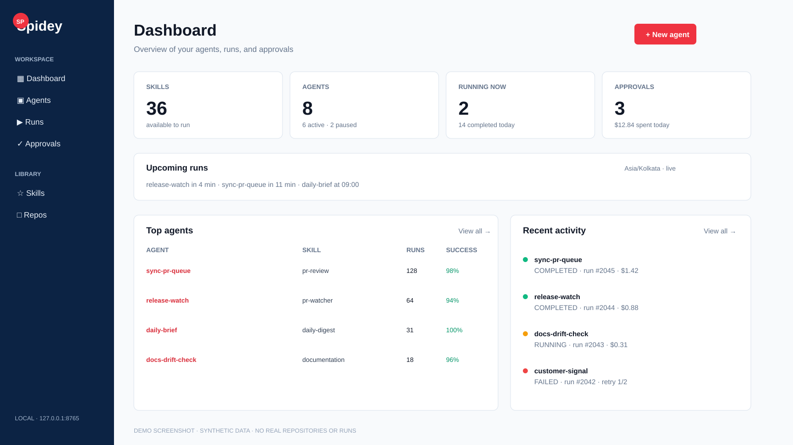
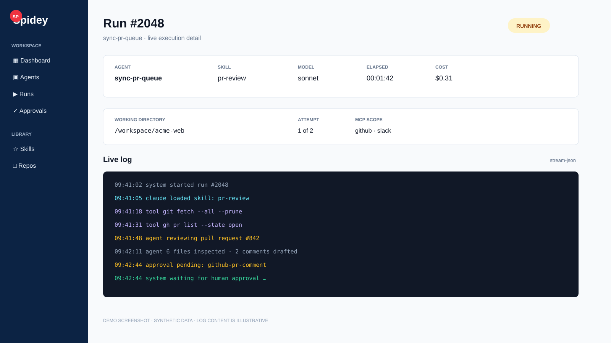

# Spidey

A local dashboard for running, scheduling, and observing Claude Code skills across
any folder on your machine — with per-agent MCP scoping, cost/turn/timeout caps,
retries, autopilot, failure notifications, and a draft-first approval queue for
outbound actions.

Nothing runs in the cloud. Everything is a local Python process talking to a
subprocess of the same `claude` CLI you already use.

> **Security boundary:** Spidey is designed for one trusted user on one
> machine. It has no login system and can launch `claude` with access to any
> directory you register. Keep it bound to `127.0.0.1`; do not expose it to a
> LAN or public internet without adding authentication, authorization, tenant
> isolation, and a sandbox around agent execution.

---

**For anything about running this long-term (sleep, reboot, LaunchAgent, battery
cost, when to consider a server), see [`docs/DEPLOYMENT.md`](docs/DEPLOYMENT.md).**

---

## Table of contents

1. [What it is / what it isn't](#what-it-is--what-it-isnt)
2. [Quick start](#quick-start)
3. [Security](#security)
4. [Screenshots](#screenshots)
5. [Operating model](#operating-model)
6. [Architecture: what happens when an agent runs](#architecture-what-happens-when-an-agent-runs)
7. [UI overview — every page](#ui-overview--every-page)
8. [Data model — every table + every column](#data-model--every-table--every-column)
9. [Agent-level settings](#agent-level-settings)
10. [MCP scoping](#mcp-scoping)
11. [Approvals + safety model](#approvals--safety-model)
12. [Skill sync](#skill-sync)
13. [Files & directory layout](#files--directory-layout)
14. [Environment variables](#environment-variables)
15. [Extending — wiring real senders, custom skills](#extending--wiring-real-senders-custom-skills)
16. [Troubleshooting](#troubleshooting)
17. [Roadmap](#roadmap)

---

## What it is / what it isn't

**Is:**
- A FastAPI web app on `http://127.0.0.1:8765` that lets you point-and-click Claude Code skills at any repo
- A cron-style scheduler that fires those skills on a recurring basis
- A live log tail for every run
- A per-agent config surface: model, MCPs, timeout, retries, cost caps, env vars, autopilot, notifications
- A safety net that intercepts outbound network actions and queues them for human approval

**Isn't:**
- A hosted service — everything runs on your Mac
- A replacement for `claude` — it launches `claude` as a subprocess
- A multi-user tool — designed for one person on one machine
- An LLM by itself — no model calls without `claude` doing them

---

## Quick start

Requires Python 3.9+, `claude` on your `PATH` (already the case if you use Claude Code).

```bash
cd agent-hub
cp config/local.example.json config/local.json
# Edit config/local.json and set skills.managed_repo to your my-agents checkout.
./run.sh
```

First run creates `.venv/`, installs deps from `requirements.txt`, and starts uvicorn.
Open http://127.0.0.1:8765.

## Security

Agent Hub is publishable as source code and safe for other users to run locally,
but it is not a public hosted service. The UI can start subprocesses, read local
MCP configuration, access registered repositories, and store agent-provided
environment variables. The default loopback bind is intentional.

Before building a shared or hosted version, add at minimum:

- authentication and authorization for every route;
- per-user and per-tenant repository isolation;
- a sandboxed worker instead of direct host subprocess execution;
- secret management rather than storing arbitrary environment variables in SQLite;
- rate limits, quotas, audit logging, and CSRF protection;
- an allowlist for executable tools and MCP servers.

See [SECURITY.md](SECURITY.md) for reporting vulnerabilities.

## Screenshots

These are synthetic demo screenshots. Names, counts, costs, repositories, and
log lines are illustrative; no personal or production data is included.

### Dashboard overview



The dashboard answers four questions quickly: what can run, which agents are
active, what is running now, and whether anything needs approval.

### A running agent



Each run has a stable ID, a workspace, model, cost, MCP scope, attempt number,
and a live log. Approval-required actions stop at a visible human checkpoint.

## Operating model

The shortest way to understand Agent Hub is:

1. The Hub owns schedules, run history, logs, and approvals.
2. An agent is a named schedule plus a skill, workspace, prompt, and policy.
3. A run is one execution attempt of that agent.
4. The runner starts `claude` in the selected workspace.
5. Outbound actions become approval artifacts before they are dispatched.

The current release is single-node. It supports many agents on one trusted
machine, but it does not coordinate multiple Hub processes. Read
[`docs/OPERATING_MODEL.md`](docs/OPERATING_MODEL.md) before deploying it on
multiple machines or designing a worker cluster.

**One-time recommended setup:** unify your skills between `~/.claude/` and your
configured managed skills repository:

```bash
./bin/sync-skills.sh install
```

That makes `~/.claude/skills` and `~/.claude/commands` symlinks to the configured
repository's `claude/skills/` and `claude/commands/`. Editing either location
edits the same file.
See [Skill sync](#skill-sync) for details.

Agent Hub is intentionally separate from the skills repository. Configure the
relationship in `config/local.json`:

```json
{
  "agent_hub": {
    "plist_label_prefix": "com.yourname.agent-hub",
    "hostname": "localhost",
    "port": 8765
  },
  "skills": {
    "managed_repo": "/Users/yourname/WorkSpace/my-agents"
  }
}
```

### After a system restart

Only Spidey itself needs to be restarted — everything else (puma-dev, LaunchAgents)
comes back on login.

```bash
cd ~/WorkSpace/agent-hub && ./run.sh
```

Then open one of:

- `http://myspidey.me/` — via puma-dev (see below)
- `https://myspidey.me/` — same, with puma-dev's self-signed cert
- `http://127.0.0.1:8765/` — direct, bypasses puma-dev

### Optional: local hostname (myspidey.me)

If you use [puma-dev](https://github.com/puma/puma-dev) for local Rails development,
you can reach the dashboard through a friendlier URL. puma-dev already handles the
`.me` and `.test` TLDs (via `/etc/resolver/*`) and auto-starts as a LaunchAgent, so
the only piece specific to Spidey is a one-line file that tells puma-dev where
to proxy. `myspidey` and `8765` below are examples — use whatever hostname and
port you set in `agent_hub.hostname` / `agent_hub.port` in `config/local.json`
(see `config/README.md`):

```bash
echo 8765 > ~/.puma-dev/myspidey
```

After that, any `myspidey.*` request lands on `127.0.0.1:8765`. Both HTTP and HTTPS
work; puma-dev serves a self-signed cert on `:443`.

Fresh machine? Two lines to get back to `http://myspidey.me/` (again, substitute
your own configured hostname/port):

```bash
echo 8765 > ~/.puma-dev/myspidey
cd ~/WorkSpace/agent-hub && ./run.sh
```

---

## Architecture: what happens when an agent runs

**No terminal opens.** No visible window. The FastAPI app spawns `claude` as a
headless child process and reads its `stream-json` events over a pipe.

```
                           ┌────────────────────────────────────────┐
 you click "Run"           │  Browser (Jinja + HTMX polling every   │
        │                  │  2-3s for live counters + log tail)    │
        ▼                  └────────────────────────────────────────┘
┌───────────────────────────────────────┐                 ▲
│ FastAPI @ 127.0.0.1:8765              │                 │
│                                       │   HTML          │
│  POST /run  or  scheduler tick        │─────────────────┘
│  └─► runner.start_run(...)            │
│       ├─► resolve skill + working_dir │
│       ├─► generate temp MCP config    │  ⇒ data/mcp-configs/run-NN.json (0600)
│       ├─► INSERT runs row (queued)    │
│       └─► spawn Python daemon thread ─┼─────┐
└───────────────────────────────────────┘     │
                                              ▼
                    ┌─────────────────────────────────────────────┐
                    │ Background thread (runner._execute)         │
                    │                                             │
                    │   subprocess.Popen(                          │
                    │     ["claude", "-p", "<invocation>+prompt", │
                    │      "--output-format", "stream-json",     │
                    │      "--verbose",                          │
                    │      "--permission-mode", "acceptEdits",   │
                    │      "--model", "<agent.model>",           │
                    │      "--max-turns", "<agent.max_turns>",   │
                    │      "--mcp-config", "<temp>",             │
                    │      "--strict-mcp-config"],               │
                    │     cwd=<target repo>,                     │
                    │     env=os.environ + agent.env_vars,       │
                    │     preexec_fn=os.setsid)  ← own pgrp      │
                    │                                             │
                    │   Timer(timeout_seconds) ─► SIGTERM         │
                    │                          ─► SIGKILL +3s    │
                    │                                             │
                    │   for line in proc.stdout:                  │
                    │     parse JSON event → summarize            │
                    │     INSERT run_logs                         │
                    └─────────────────────────────────────────────┘
                                              │
                                              ▼
                    ┌─────────────────────────────────────────────┐
                    │ Process exits — post-processing:            │
                    │  • status = completed / failed / timed_out  │
                    │  • total_cost_usd captured from result event│
                    │  • cost > max_cost_usd? warn in logs        │
                    │  • scan <cwd>/.agent-hub-inbox/*.json       │
                    │      → insert approvals rows                │
                    │      → if autopilot: auto-approve           │
                    │  • failed + notify_on_failure               │
                    │      → drop slack-message approval          │
                    │  • failed + retry_count > 0                 │
                    │      → APScheduler DateTrigger(+N seconds)  │
                    │  • delete temp MCP config                   │
                    └─────────────────────────────────────────────┘
```

Everything the run produces — stdout lines, cost, exit code, whether it timed
out, which attempt number — is persisted in SQLite so you can review it later.

---

## UI overview — every page

Sidebar navigation on the left. Every page uses the same shell.

### `/` — Dashboard
- 4 hero KPI cards: **Skills**, **Agents** (active/total), **Running now**, **Approvals** (with $ spent today)
- **Top agents** panel: table of your enabled agents with success rate + "Run now" button
- **Recent activity** feed: last 12 runs with a coloured dot per status, streamed via HTMX every 3s
- Topbar buttons: **New run** (→ `/skills`), **New agent** (→ `/agents`)

### `/skills`
- Full skills library (all `.md` files discovered from `~/.claude/skills`, `~/.claude/commands`, and the configured managed repository's `claude/`)
- Search box (name + description) and filter chips per kind (user-skill / user-command / repo-skill / repo-command)
- Each card has an inline **Run** form with repo picker, permission mode, and an optional MCP picker
- **Skill sync panel** at the top showing current link state (`fully linked`, `per-file symlinked`, `drift`) with **Sync now**, **Link home → repo**, **Install auto-sync** buttons — see [Skill sync](#skill-sync)

### `/agents`
- Table of every scheduled agent with: name, skill, cron, repo, **MCPs badges**, last run status, success rate %, cumulative cost
- **+ New agent** panel at the top: full form including an "Advanced settings" collapsible with model / turns / cost / timeout / retries / autopilot / notify / env vars
- Row actions: **Run now**, **Pause/Resume**, **Delete**

### `/agents/{id}`
- Per-agent KPIs: total runs, success count + rate, failure count, cumulative cost
- **Notes** panel (if set)
- **Overview** panel with skill/repo/cron/status and status-badge summary (`autopilot`, `notify on failure`, `retries: N`, `timeout: 300s`, model)
- **Settings** panel — every field is editable in one form with a Save button
- **MCP servers** panel with checkboxes for enabling/disabling specific MCPs
- **Run history** table (last 100 runs) with attempt number, status, times, cost

### `/runs`
- Filterable list of every run (status chips: All / Running / Completed / Failed / Queued)
- Search by skill name or working directory
- Live-refreshing every 3s

### `/runs/{id}`
- Status badge + exit code + cost + timestamps + link back to source agent
- MCP badges if the run was scoped
- Collapsible **Prompt** section
- **Log** panel — dark terminal-style pane that tails via HTMX every 2s while running; freezes on completion

### `/approvals`
- Draft-first queue for outbound actions
- Filter tabs: Pending / Approved / Rejected / All
- Each row: kind (`github-pr-comment`, `slack-message`, `jira-comment`, `generic`), target, source run, status
- Approve / Reject buttons; approve dispatches (dry-run in v1, see [Extending](#extending--wiring-real-senders-custom-skills))

### `/approvals/{id}`
- Full payload view + Approve/Reject buttons if still pending

### `/repos`
- Register any folder on your machine as a "repo" — agents run with that folder as `cwd`
- Table shows agent count and run count per repo

---

## Data model — every table + every column

Storage is a single SQLite file at `data/hub.db`. All migrations are additive and idempotent (`_migrate()` in `app/db.py`).

### `repos`

A registered folder on disk — a target for agent runs.

| Column | Type | Notes |
|---|---|---|
| `id` | INTEGER PK | |
| `name` | TEXT NOT NULL UNIQUE | Human label, e.g. `HomeCloud` |
| `path` | TEXT NOT NULL UNIQUE | Absolute path, e.g. `/path/to/your/repo` |
| `created_at` | TEXT NOT NULL | ISO-8601 UTC |

### `schedules` (a.k.a. **agents**)

The word "schedule" is legacy from v1. In the UI they're called **agents**.

**Step 1 of an agent** is stored inline on this row (`skill_name`, `skill_kind`, `prompt`).
Additional steps live in the `agent_steps` table.

| Column | Type | Notes |
|---|---|---|
| `id` | INTEGER PK | |
| `name` | TEXT NOT NULL | Human label |
| `skill_name` | TEXT NOT NULL | e.g. `rr-code-review` |
| `skill_kind` | TEXT NOT NULL | `user-skill` \| `user-command` \| `repo-skill` \| `repo-command` |
| `repo_id` | INTEGER FK repos.id | NULL if `working_directory` is used instead |
| `working_directory` | TEXT NOT NULL | Absolute path passed as `cwd` to claude |
| `prompt` | TEXT NOT NULL | Free-text goal appended to the skill invocation |
| `cron_expr` | TEXT NOT NULL | Standard 5-field cron in UTC (`*/10 * * * *`) |
| `enabled` | INTEGER NOT NULL | 0/1. Pausing removes the APScheduler job. |
| `created_at` | TEXT NOT NULL | ISO-8601 UTC |
| `last_fired_at` | TEXT | Updated on every scheduler tick |
| `allowed_mcps` | TEXT | JSON array of MCP names. NULL = inherit all. |
| `model` | TEXT | e.g. `claude-sonnet-4-6`. NULL = default. |
| `max_cost_usd` | REAL | Post-run soft cap. Warn in logs if exceeded. |
| `max_turns` | INTEGER | `--max-turns N` — hard cap on tool-use loops |
| `autopilot` | INTEGER | 0/1. Auto-approve outbound actions for this agent's runs. |
| `notify_on_failure` | INTEGER | 0/1. Drop a `slack-message` approval on failure. |
| `notify_target` | TEXT | Slack channel or `@user` for failure notifications |
| `timeout_seconds` | INTEGER | Hard kill via SIGTERM→SIGKILL |
| `retry_count` | INTEGER | Number of retries after failure (0 = never) |
| `retry_delay_seconds` | INTEGER | Delay between retries (default 60) |
| `env_vars` | TEXT | JSON dict `{"KEY":"value", ...}` merged into subprocess env |
| `notes` | TEXT | Free-text notes about the agent |

### `runs`

Every invocation, whether manual or scheduled.

| Column | Type | Notes |
|---|---|---|
| `id` | INTEGER PK | |
| `skill_name` | TEXT NOT NULL | Snapshot of the skill at run-time |
| `skill_kind` | TEXT NOT NULL | |
| `repo_id` | INTEGER FK repos.id | May be NULL for ad-hoc runs |
| `working_directory` | TEXT NOT NULL | The actual `cwd` used |
| `prompt` | TEXT NOT NULL | The full built prompt sent to claude |
| `status` | TEXT NOT NULL | `queued` → `running` → `completed` \| `failed` |
| `exit_code` | INTEGER | Process exit code (NULL while running) |
| `error` | TEXT | Last ~20 lines of stderr, or timeout reason |
| `started_at` | TEXT NOT NULL | ISO-8601 UTC |
| `finished_at` | TEXT | Set when process exits |
| `pid` | INTEGER | OS PID of the `claude` process |
| `schedule_id` | INTEGER FK schedules.id | NULL = ad-hoc; set for scheduled + retry runs |
| `total_cost_usd` | REAL | Parsed from the final `result` stream event |
| `allowed_mcps` | TEXT | JSON array — snapshot of the MCP filter used |
| `model` | TEXT | Snapshot of the model used |
| `attempt_number` | INTEGER | 1 for first attempt, 2+ for retries |
| `timed_out` | INTEGER | 0/1. True if runner killed the process on timeout. |

### `run_logs`

Every log line from a run.

| Column | Type | Notes |
|---|---|---|
| `id` | INTEGER PK | |
| `run_id` | INTEGER NOT NULL FK runs.id ON DELETE CASCADE | |
| `ts` | TEXT NOT NULL | ISO-8601 UTC per-line timestamp |
| `stream` | TEXT NOT NULL | `stdout` \| `stderr` \| `system` |
| `line` | TEXT NOT NULL | Truncated to 8000 chars |

### `agent_steps`

Additional steps for multi-step agents (step 1 lives on the `schedules` row).

| Column | Type | Notes |
|---|---|---|
| `id` | INTEGER PK | |
| `schedule_id` | INTEGER NOT NULL FK schedules.id ON DELETE CASCADE | |
| `position` | INTEGER NOT NULL | 1, 2, 3, ... (step 1 is the primary on the schedule row) |
| `skill_name` | TEXT NOT NULL | |
| `skill_kind` | TEXT NOT NULL | |
| `prompt` | TEXT NOT NULL DEFAULT '' | Per-step goal |
| `continue_on_error` | INTEGER NOT NULL DEFAULT 0 | If 0 and the step fails, the chain stops here. If 1, keep going. |
| `created_at` | TEXT NOT NULL | |

### `approvals`

Outbound actions awaiting human approval.

| Column | Type | Notes |
|---|---|---|
| `id` | INTEGER PK | |
| `run_id` | INTEGER FK runs.id | May be NULL for hand-created approvals |
| `kind` | TEXT NOT NULL | `github-pr-comment` \| `slack-message` \| `jira-comment` \| `generic` |
| `target` | TEXT NOT NULL | Human-readable identifier (URL, channel, ticket key) |
| `payload` | TEXT NOT NULL | Full JSON payload as dropped in `.agent-hub-inbox/` |
| `status` | TEXT NOT NULL | `pending` \| `approved` \| `rejected` |
| `created_at` | TEXT NOT NULL | |
| `resolved_at` | TEXT | Set when approved or rejected |

---

## Agent-level settings

### Multi-step agents

An agent can carry an ordered list of skills to run in sequence:

- **Step 1** (primary) is stored on the `schedules` row itself
- **Steps 2+** live in the `agent_steps` table (position 1, 2, 3, ...)
- On each tick, the scheduler assembles the ordered list and calls `runner.start_chain(...)`
- Each step becomes its own `runs` row: step 1 has `parent_run_id=NULL, step_position=0`; subsequent steps have `parent_run_id=<step-1's id>` and `step_position=1, 2, ...`
- If a step fails and `continue_on_error=0`, the chain aborts. If `1`, the next step still runs.
- Retry policy applies at the **chain** level: a failed chain re-schedules from step 1 with `attempt_number+1`, not from the failed step

### Schedule builder (no more cron by hand)

The UI has a friendly picker instead of raw cron:

- **Every N minutes** — `*/N * * * *`
- **Every hour at :M** — `M * * * *`
- **Daily at HH:MM** — `MM HH * * *`
- **Weekly on `<day>` at HH:MM** — `MM HH * * <dow>`
- **Monthly on day D at HH:MM** — `MM HH D * *`
- **Custom cron** — for anything the presets don't cover

`build_cron(...)` in `app/main.py` converts form fields → cron. `cron_to_builder(...)` reverse-parses an existing cron back into the picker for edit views. The DB continues to store the cron string.

---

## Agent-level settings

Every setting an agent can carry, and how it maps to runtime:

| UI field | DB column | Runtime effect |
|---|---|---|
| **Name** | `name` | Display only |
| **Notes** | `notes` | Display only. Free text. |
| **Cron** | `cron_expr` | 5-field UTC cron for APScheduler |
| **Skill + kind** | `skill_name`, `skill_kind` | Chooses which `.md` invocation to send |
| **Repo / Working directory** | `repo_id` OR `working_directory` | Sets `cwd` for the `claude` subprocess |
| **Prompt** | `prompt` | Appended to the skill invocation as the user goal |
| **MCP servers** | `allowed_mcps` (JSON) | Empty → all inherited. Filled → temp `mcp-config` file + `--mcp-config --strict-mcp-config`. See [MCP scoping](#mcp-scoping). |
| **Model** | `model` | `--model <id>`. Blank = claude's default. |
| **Max turns** | `max_turns` | `--max-turns N`. Hard cap on tool-use loop iterations. |
| **Max cost per run ($)** | `max_cost_usd` | Soft: run finishes, cost checked, `⚠ cost exceeded` line appended. No mid-flight kill (v1). |
| **Timeout (seconds)** | `timeout_seconds` | `threading.Timer` → `SIGTERM` process group → `SIGKILL` after 3s. Run flagged `timed_out=1`. |
| **Retry count** | `retry_count` | On failure, schedule a re-run via APScheduler `DateTrigger`. `attempt_number` on the child run is `parent + 1`. |
| **Retry delay** | `retry_delay_seconds` | Wall-clock seconds before retry fires |
| **Autopilot** | `autopilot` (0/1) | When approvals are created for this agent's runs, auto-approve them immediately (skips the queue) |
| **Notify on failure** | `notify_on_failure` (0/1) | On failed run, drop a `slack-message` approval to `notify_target` with the error summary |
| **Notify target** | `notify_target` | Slack channel like `#eng-alerts` or `@user` |
| **Env vars** | `env_vars` (JSON dict) | Merged into `os.environ.copy()` for the subprocess. Useful for `GITHUB_TOKEN`, feature flags, etc. |

---

## MCP scoping

Each run can be scoped to a specific set of MCP servers. This matters because:
- Loading all MCPs bloats the system prompt (tool schemas eat tokens)
- Some MCPs spawn subprocesses (memory + startup latency)
- Agents typically only need one or two MCPs

**Discovery:** on any page that needs the MCP list, `app/mcps.py::discover_mcps(cwd)` reads:
- `~/.claude.json` (`mcpServers`) — user runtime state
- `~/.claude/settings.json` (`mcpServers`) — user settings
- `<cwd>/.mcp.json` — project-level
- `<cwd>/.claude/settings.json` — project settings

Deduped by name; earlier sources win.

**Runtime:** when an agent has `allowed_mcps = ["jira","slack"]`, the runner:
1. Writes `data/mcp-configs/run-<id>.json` with only those two servers (copied straight from the source config so credentials/env are preserved). File permissions set to `0600`.
2. Passes `--mcp-config <path> --strict-mcp-config` to `claude`. `--strict-mcp-config` makes that list authoritative — no ambient MCPs merged in.
3. Deletes the temp file after the run exits (success or fail).

Empty `allowed_mcps` (NULL) → no flags passed → all inherited from user config.

---

## Approvals + safety model

**Draft-first** by default. Skills that want to post externally (PR comment, Slack message, Jira comment) are instructed via a prompt appendix to write a JSON file to `<cwd>/.agent-hub-inbox/*.json` instead of calling the tool directly.

Inbox JSON schema:

```json
{
  "kind": "github-pr-comment" | "slack-message" | "jira-comment" | "generic",
  "target": "human-readable identifier (URL, channel, ticket key)",
  "body": "...",
  "meta": { "any": "extra structured data" }
}
```

**When a run exits:** `runner._execute()` calls `approvals.scan_inbox(run_id, cwd, schedule_id)`:
- Every JSON file → one row in `approvals` with `status='pending'`
- The file is moved to `<cwd>/.agent-hub-inbox/processed/`
- If the source agent has `autopilot=1`, `approve()` is called immediately

**When a run fails and `notify_on_failure=1`:** `approvals.maybe_notify_failure(schedule_id, run_id, error)` creates a `slack-message` approval targeting `notify_target` with the failure summary — same autopilot logic applies.

**Dispatch (`approvals._dispatch`):** currently a **dry-run** — records intent, does not actually call the external API. This is deliberate for v1: you can see exactly what would be sent before committing to wire up real senders. See [Extending](#extending--wiring-real-senders-custom-skills).

---

## Skill sync

Claude Code reads skills from `~/.claude/skills/` and `~/.claude/commands/`. Keeping those in sync with a git-tracked repo (like this one) is the classic dotfiles problem. Solved with `bin/sync-skills.sh`.

### Recommended one-time install

```bash
./bin/sync-skills.sh install
```

This:
1. Imports any home-only files into the configured managed repository's `claude/skills` and `claude/commands` (so that repository tracks them).
2. Backs up `~/.claude/skills` and `~/.claude/commands` to `~/.claude/*.bak-<timestamp>`.
3. Replaces them with **directory symlinks** pointing at the configured managed repository's `claude/skills` and `claude/commands`.
4. Installs a **launchd LaunchAgent** (labeled `<agent_hub.plist_label_prefix from config/local.json>.sync-skills`) that runs `sync-skills.sh sync` whenever any of the four dirs change (10-second throttle) — a safety net for when the symlinks get broken.

Result: `~/.claude/skills` **is** the configured managed repository's `claude/skills`. Editing anywhere edits the same file. Commit changes from that managed repository.

### All subcommands

| Command | What it does |
|---|---|
| `status` | Reports link state (`fully linked` / `per-file symlinked` / `drift`), per-file breakdown, daemon status |
| `sync` | Bidirectional rsync (newer wins) — safe idempotent no-op after `link` |
| `link` | Merge home into repo, symlink home → repo directories |
| `install` | `link` + install the launchd daemon |
| `unlink` | Break symlinks and restore actual directories (copies from repo) |
| `install-daemon` / `uninstall-daemon` | Just the launchd bit |
| `help` | Show all this |

The UI also exposes these — see the sync panel at the top of `/skills`.

---

## Files & directory layout

```
agent-hub/
├── app/                            Python package
│   ├── __init__.py
│   ├── main.py                     FastAPI routes + Jinja setup
│   ├── db.py                       SQLite schema + additive migrations
│   ├── settings.py                 Paths + env vars
│   ├── skills.py                   Filesystem skill discovery
│   ├── runner.py                   subprocess claude, streaming, timeout, retry
│   ├── scheduler.py                APScheduler wiring
│   ├── approvals.py                Inbox scan + dispatch (dry-run) + notify
│   ├── mcps.py                     MCP config discovery + scoped-config generator
│   ├── static/style.css            Full light-theme UI stylesheet
│   └── templates/
│       ├── base.html               Sidebar shell
│       ├── dashboard.html
│       ├── skills.html
│       ├── agents.html
│       ├── agent_detail.html
│       ├── runs.html
│       ├── run_detail.html
│       ├── approvals.html
│       ├── approval_detail.html
│       ├── repos.html
│       ├── _dashboard_kpis.html    HTMX partials (live refresh)
│       ├── _activity.html
│       ├── _runs_table.html
│       ├── _run_log.html
│       ├── _mcp_picker.html        Reusable MCP checkbox grid
│       └── _icons/                 Small SVG icons for sidebar + buttons
│
├── bin/
│   └── sync-skills.sh              Skill/command sync + launchd daemon
├── docs/
│   ├── OPERATING_MODEL.md          Single-node and cluster deployment model
│   └── screenshots/                 Synthetic dashboard and run examples
│
├── data/                           gitignored — runtime state
│   ├── hub.db                      SQLite (WAL mode)
│   └── mcp-configs/                Per-run temp MCP configs (auto-cleaned)
│
├── requirements.txt
├── run.sh                          One-liner to create venv + start server
└── README.md                       This file
```

---

## Environment variables

Read by `app/settings.py`. All optional.

| Var | Default | Purpose |
|---|---|---|
| `CLAUDE_BIN` | auto-detected via `which claude` | Override path to the `claude` binary |
| `HUB_MODEL` | *(empty)* | Global default model, passed as `--model`. Per-agent `model` overrides this. |
| `HUB_PERMISSION_MODE` | `acceptEdits` | Default permission mode. Options: `default`, `acceptEdits`, `bypassPermissions`, `plan` |

Per-agent `env_vars` (a JSON dict on the schedule row) are merged into the subprocess environment on each run — that's where things like `GITHUB_TOKEN`, `SLACK_WEBHOOK_URL`, or custom feature flags belong.

---

## Extending — wiring real senders, custom skills

### Turn approvals into real actions

Right now `approvals._dispatch()` returns `{"dry_run": True, ...}`. To actually send:

```python
# app/approvals.py
def _dispatch(kind, target, payload):
    if kind == "github-pr-comment":
        # pip install PyGithub, put GH_TOKEN in the agent's env_vars
        from github import Github
        gh = Github(os.environ["GH_TOKEN"])
        owner, repo, num = _parse_pr_url(target)
        gh.get_repo(f"{owner}/{repo}").get_pull(num).create_issue_comment(payload["body"])
        return {"posted": True}
    if kind == "slack-message":
        from slack_sdk import WebClient
        client = WebClient(token=os.environ["SLACK_BOT_TOKEN"])
        client.chat_postMessage(channel=target, text=payload["body"])
        return {"posted": True}
    if kind == "jira-comment":
        from jira import JIRA
        j = JIRA(server=os.environ["JIRA_URL"], token_auth=os.environ["JIRA_TOKEN"])
        j.add_comment(target, payload["body"])
        return {"posted": True}
    return {"dry_run": True, "kind": kind}
```

Store tokens in `~/.zshrc` or in individual agents' `env_vars` — never commit them.

### Add a new skill

Just drop an `.md` file with YAML frontmatter:

```markdown
---
name: my-skill
description: What it does. Shown in the skill grid.
---

# my-skill

Instructions to Claude go here in markdown. Anything about how to accomplish
the task, what files to touch, what to output.

Because you're running under Spidey, any outbound action (PR comment,
Slack message, Jira update) should be written as a JSON file in
`.agent-hub-inbox/` rather than called directly.
```

Save it in `<managed-repo>/claude/skills/my-skill.md` — because of the sync symlink,
it immediately appears in `~/.claude/skills/` too, meaning both Claude Code CLI
and Spidey pick it up on next request.

### Add a new approval kind

Add it to `ALLOWED_KINDS` in `app/approvals.py`, add a tag colour in
`app/static/style.css`, and add a dispatch branch in `_dispatch`.

---

## Troubleshooting

**Server won't start:** check `/tmp/agent-hub.log` (that's where `run.sh`
redirects output). Most common cause: port 8765 already in use — `lsof -i :8765`
to check.

**Skill runs immediately fail with "claude binary not found":** set
`CLAUDE_BIN=/full/path/to/claude` in your environment before `./run.sh`.

**Run appears stuck / no logs:** the `claude` subprocess may be waiting for
approval on a permission it can't get in non-interactive mode. Try
`permission_mode: plan` for a read-only test, or `acceptEdits` (default).
For runs that must touch shell/network without approval, `bypassPermissions` —
sparingly.

**A scheduled agent didn't fire:** check that the app is running (APScheduler
is in-process; if `./run.sh` isn't running, nothing fires). `bin/sync-skills.sh
status` won't help here — it's for skill files, not the app. If you need agents
to fire without keeping the app open, you'll need to install a launchd job for
the app itself; not yet built.

**Failed run wasn't retried:** retries only apply to runs launched via a
schedule (`schedule_id` set). Ad-hoc runs from `/skills` don't retry. Also
check that `retry_count > 0` on the agent.

**Skill sync says "drift":** run `bin/sync-skills.sh sync` (safe, no-op if
already in sync). If you meant to have home-only files, that's expected drift —
either import them (`link`) or ignore.

**Everything is dry-run — approving does nothing visible:** correct, in v1 —
see [Extending](#extending--wiring-real-senders-custom-skills) to wire real senders.

---

## Roadmap

Not built yet, roughly in priority order:

- **Real senders** in `approvals._dispatch` for GitHub / Slack / Jira
- **Kill button** on running runs (currently requires `kill <pid>` from a terminal)
- **launchd job for the app itself** so scheduled agents run without keeping `./run.sh` open
- **Hard cost cap** — kill mid-flight when cumulative cost exceeds `max_cost_usd` (requires per-message token accounting)
- **Auth/tokens page** in the UI so env vars aren't only editable per-agent
- **Cost graph** — trend line on the dashboard
- **Bulk operations** — pause all, run selected, etc.
- **API endpoint** — trigger runs from other tools (curl-friendly)
